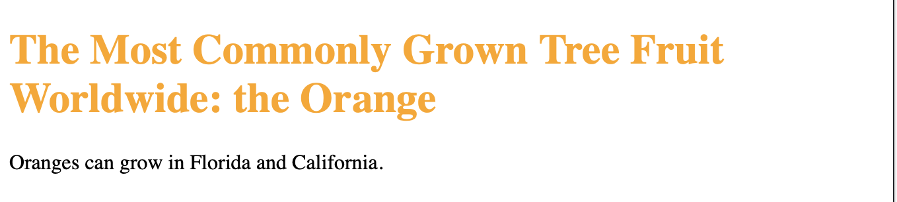

# CSS Lab 2

This lab covers an introduction to CSS syntax. 
Prerequisite: HTML tags

To add style, you need to specify the style changes (make it blue? make it line up with the right side of the page?) and what parts of the webpage should have those style changes. Talking about the parts of the webpage involves at least beginner level knowledge of HTML elements. 

The following are examples of using CSS to say what style changes you want and what HTML elements you want to affect. 

Example CSS:
```css
h1 {
  color: orange;
}
``` 

Example HTML:
```html
<!DOCTYPE html>
<html lang="en">
   <body>
      <h1>The Most Commonly Grown Tree Fruit Worldwide: the Orange</h1>
      <p>Oranges can grow in Florida and California.</p>
   </body>
</html>
```

A website would combine the above CSS (style) and HTML (content) to show:  


# Link to Example

[Test on JSFiddle](https://jsfiddle.net/k_staple/thg8n3o6/12/)


# Experiment Ideas
1. Change the color of the header
2. Add to the CSS to change the color of the paragraph
