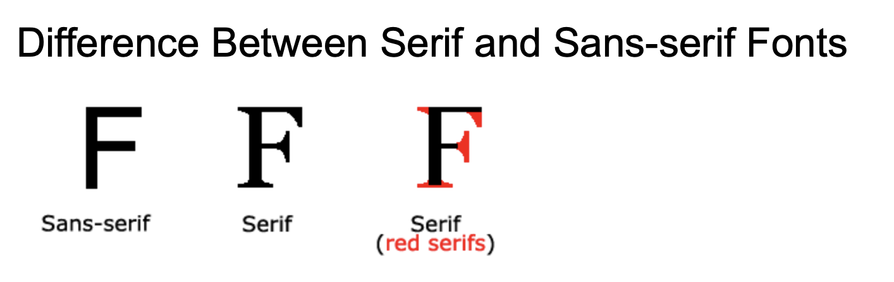
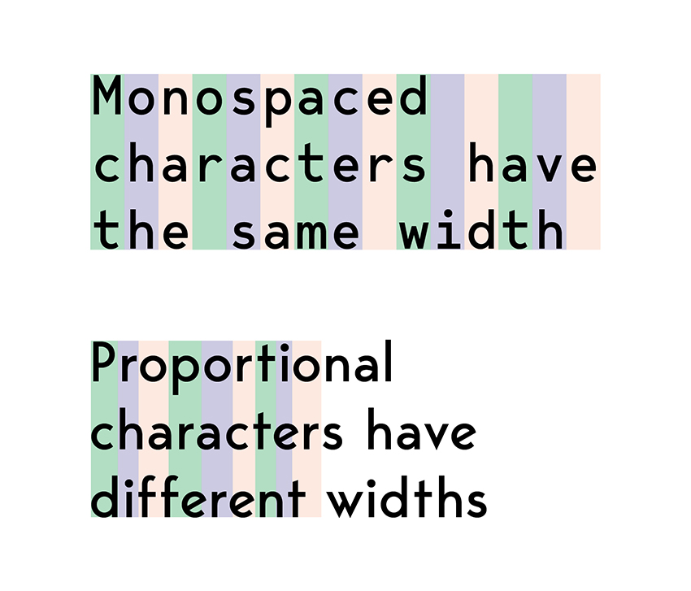
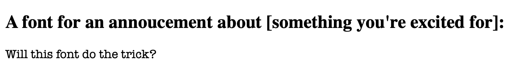

# CSS Lab 3

This lab covers using CSS to change font. 

Not all computers can show all fonts. Therefore, to change font with css, you specify a list with backups. The font-family property first looks to display the specific font name such as Arial that in the list. In case some computer can't display that font, you can list backup fonts. Finally, you should list a font family as a catch-all to make sure the displayed font is at least in the right font family.

Fonts are grouped into three major families: serif, sans-serif, and monospace. The below image from w3schools shows what a serif is. Serif fonts have serifs and sans-serif, sans meaning without, don't.



As for monospace family fonts, those fonts all have letters with the same width as the below image from design company Envato shows:


There are two other lesser used font families: cursive and fantasy.

CSS:
```css
p {
  font-family: American Typewriter, serif;
}
``` 

HTML:
```html
<!DOCTYPE html>
<html lang="en">
   <body>
      <h2>A font for an annoucement about [something you're excited for]:</h2>
      <p>Will this font do the trick?</p>
   </body>
</html>
```

A website would combine the above CSS and HTML to show:  


# Link to Example

[Test on JSFiddle](https://jsfiddle.net/k_staple/jvznhfaq/10/)


# Experiment Ideas
1. Personalize the header & change fonts
   [A List of Built-in Font Options](https://www.w3.org/Style/Examples/007/fonts.en.html)

2. If the HTML link and head elements are understood, try google fonts
   [A List of (Free) Google Fonts](https://www.w3schools.com/howto/howto_google_fonts.asp)
