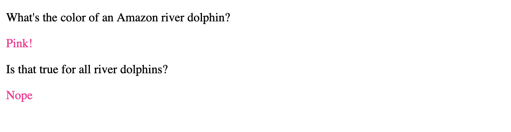

# CSS Lab 4

This lab covers styling by class. 

You know how to style all paragraphs or all headers of a certain size at the same time, but how do we add styling to several, say paragraphs, without changing the styling of all of them? Use classes. Choose a class name & add class="the_class_name" into the opening tag of an HTML element. As for the CSS, the part inside the curly brackets {} is the same. To have the CSS style inside the curly brackets apply to all the HTML elements with a certain class, write a period directly followed by the class name in front of the curly brackets where before you had a type of HTML element.

CSS:
```css
.amazon_river_dolphin {
  color: DeepPink;
}
``` 

HTML:
```html
<!DOCTYPE html>
<html lang="en">
   <body>
      <p>What's the color of an Amazon river dolphin?</p>
      <p class="amazon_river_dolphin">Pink!</p>
      <p>Is that true for all river dolphins?</p>
      <p class="amazon_river_dolphin">Nope</p>
   </body>
</html>
```

A website would combine the above CSS and HTML to show:  


# Link to Example

[Test on JSFiddle](https://jsfiddle.net/k_staple/57v6f2ba/11/)


# Experiment Ideas
1. Change which paragraph elements have the class
2. Change the color to a different word and then to rgb(255, 20, 147) and/or #ff1493 to introduce the idea those other representations also mean the same DeepPink color
   [The w3schools color picker with DeepPink currently selected](https://www.w3schools.com/colors/colors_picker.asp?colorhex=FF1493)
   [A further explanation of the different ways to specify a color](https://www.w3schools.com/colors/default.asp)
