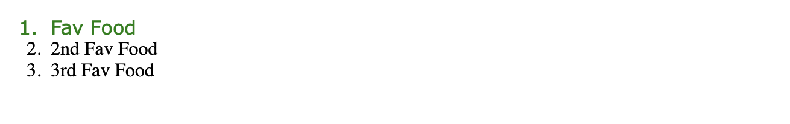

# CSS- CSS Selectors

This lab covers CSS selectors. 

So far, we've covered selecting all paragraph elements or selecting all elements with a certain class to have a certain style applied. Another common way to select elements is by id. Ids are generally a unique name for a single HTML element. Similarly to how selecting by class is .class, selecting by id is #id.

CSS:
```css
#best {
  color: green;
  font-family: Verdana, Arial, sans-serif;
}
``` 

HTML:
```html
<!DOCTYPE html>
<html lang="en">
   <body>
     <ol>
       <li id="best">Fav Food</li>
       <li>2nd Fav Food</li>
       <li>3rd Fav Food</li>
     </ol>
   </body>
</html>
```

A website would combine the above CSS and HTML to show:  


# Link to Example

[Test on JSFiddle](https://jsfiddle.net/k_staple/w8jn74dq/5/)


# Experiment Ideas
1. Add an id to the third favorite food and style it differently than the first favorite food
2. Change the style within the {}
