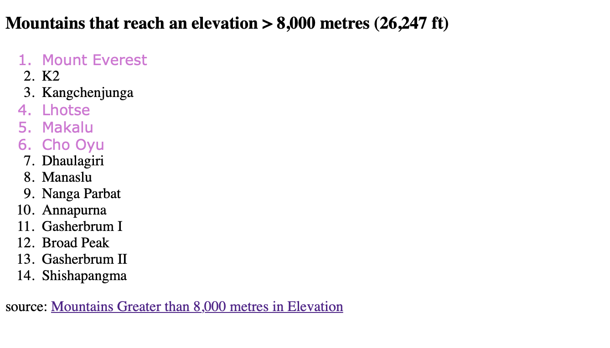

# CSS Lab 6

This lab covers combining CSS selectors. 

Beyond selecting all elements of the same HTML element type or all items with a certain class, you can combine CSS selectors to be more specific in what elements you select. For example, you can select elements that have both of two specified classes by `.class1_name.class2_name`. Be careful about using periods & no spacing. `.class1_name .class2_name` with a space in between the two `.class_name`s selects any element with class2 that is also a descendant of an element with class1.

CSS:
```css
.Himalayas.China {
  color: MediumPurple;
  font-family: Verdana, Arial, sans-serif;
}
``` 

Note: < is a reserved character in HTML, and the browser may get confused if you use it as the less than character in text. Therefore, use `&entity_name;` or `&#entity_number;`. Entity numbers have wider support. Also, listing multiple words with the quotes after class= means that element has several classes. 

Note on the content: the first class for each list element below is the mountain range and the following classes are the country/countries that mountain is in according to the source I found.

HTML:
```html
<!DOCTYPE html>
<html lang="en">
   <body>
     <h3>Mountains that reach an elevation &lt; 8,000 metres (26,247 ft)</h3>
     <ol>
       <li class="Himalayas Nepal China">Mount Everest</li>
       <li class="Karakoram Pakistan">K2</li>
       <li class="Himalayas Nepal India">Kangchenjunga</li>
       <li class="Himalayas Nepal China">Lhotse</li>
       <li class="Himalayas Nepal China">Makalu</li>
       <li class="Himalayas Nepal China">Cho Oyu</li>
       <li class="Himalayas Nepal">Dhaulagiri</li>
       <li class="Himalayas Nepal">Manaslu</li>
       <li class="Himalayas Pakistan">Nanga Parbat</li>
       <li class="Himalayas Nepal">Annapurna</li>
       <li class="Karakoram Pakistan China">Gasherbrum I</li>
       <li class="Karakoram Pakistan China">Broad Peak</li>
       <li class="Karakoram Pakistan China">Gasherbrum II</li>
       <li class="Himalayas Tibet">Shishapangma</li>
     </ol>
     <p>source: <a href="https://en.wikipedia.org/wiki/List_of_mountains_by_elevation">Mountains Greater than 8,000 metres in Elevation</a>
     </p>
   </body>
</html>
```

A website would combine the above CSS and HTML to show:  


# Link to Example

[Test on JSFiddle](https://jsfiddle.net/k_staple/tva7gz9m/12/)

Note: if you click on a link in JSFiddle instead of right clicking and opening in a new tab, you can always hit run again in the JSFiddle window.


# Experiment Ideas
1. Change which two classes you're selecting.
2. Use [this list of css selectors](https://www.w3schools.com/cssref/css_selectors.asp) to test other ways to select HTML elements
3. [To talk more about HTML entities, click here](https://www.w3schools.com/html/html_entities.asp)
