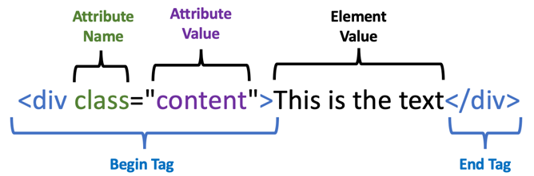

# Elements and Attributes
HTML is composed of a tree-structure of things called "elements".  Just like a tree, HTML files have a single root (think of a trunk), many branch elements that contain other elements, and finally leaves of the tree that contain the text that we display on a page. Elements are usually composed of pairs of tags - begin tags and end tags.  Here are the main parts of an element:



* The begin tag is the start of the element.  It always starts with a "less then" character and ends with a "greater than" character.
* The begin tag can have many attributes which are name-value pairs
* The name-value pairs are composed of attribute names, followed by an equal sign, followed by the attribute values surrounded by double quotes
* The begin and end tags surround the element text.  This is usually the leaf element or other branch elements
* The element text is followed by an end tag.  Note that the end tag has the same characters as a begin tag but it also has a forward slash after the less-than character.

What is difficult to understand is that elements can contain other elements which in turn can contain other elements.  Here is an example of this tree structure:

```xml
<root>
   <branch>
      <branch>
         <branch>This is the leaf text.</branch>
      </branch>
   </branch>
<root>
```

It is also interesting to note that it does not matter where 
you put newlines (carriage returns) between the branch elements.  HTML will render the same within the browser.

The following is the same as the markup above:
```xml
<root><branch><branch>
         <branch>This is the leaf text.</branch>
</branch></branch><root>
```

If you are new to markup languages, this terminology of "elements" and "attributes" and the rules will seem a bit odd at first.  However, as you begin to use it you will learn to
appreciate how allowing us to be flexible with the way spaces are used when
we create the HTML files to be convenient.  It allows us to use consistent rules for how to display the test on a web page.

## Empty Elements
There are some places in an HTML file where the contents of the element is empty. For these elements there is no end element and you add a forward slash
before the greater then.

Examples of empty elements:

```html
<br/> <!-- newline break -->
 <!-- image with no text value -->
<input type="text" id="firstName" name="firstName"/> <!-- input field -->
```
